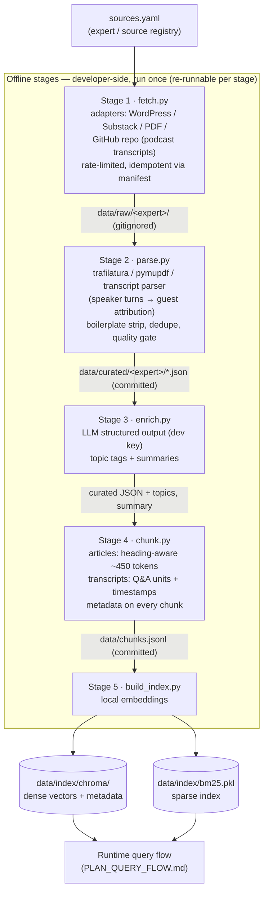

# Data Ingestion Pipeline Plan — AI PDM Leadership Council

Detailed plan for phases 1–2 of `PLAN.md`: collecting, curating, and indexing the expert corpus.

## Pipeline at a glance



Each arrow is a file on disk — no stage calls the next, so any stage can be re-run alone.

## Design principles

1. **Every stage writes files, no stage calls the next.** Fetch → parse → enrich → chunk → index
   are separate scripts connected only by files on disk. Any stage can be re-run alone; a bad
   parser fix doesn't mean re-scraping.
2. **Idempotent and incremental.** A manifest tracks what's been fetched; re-running skips
   existing content. Rate-limited, honest User-Agent, respects robots.txt.
3. **Expert attribution never leaves the data.** The `expert` field travels from the source
   registry through every stage into each chunk's metadata — it's what powers both app modes.
4. **No API cost at runtime.** All LLM-assisted curation happens offline with the developer's
   own key (read from env, never committed). The deployed app only ever generates answers with
   the user's key.

## Stage 0 — Source audit (before writing any code)

Verify what's actually fetchable per expert. Expected landscape:

| Expert | Source | Type | Notes |
|---|---|---|---|
| Marty Cagan | svpg.com/articles | WordPress blog | Clean HTML, sitemap/RSS |
| Teresa Torres | producttalk.org | WordPress blog | RSS available |
| Casey Winters | caseyaccidental.com | WordPress blog | Free, RSS |
| Gibson Biddle | askgib.substack.com + his public DHM strategy decks | Substack + **PDF** | PDFs tick the PDF-parsing optional functionality |
| Julie Zhuo | The Looking Glass (Substack) / Medium | Substack/Medium | Free posts only |
| Lenny Rachitsky | lennysnewsletter.com | Substack | Mostly paywalled — free posts only, may yield little |
| Elena Verna | elenaverna.substack.com | Substack | Free posts only |
| Shreyas Doshi | Mostly X/Twitter threads | Hard to scrape | Fallback: skip or use his few long-form posts |
| **All council experts** | github.com/ChatPRD/lennys-podcast-transcripts | **GitHub transcript archive** | ~15 episodes covering every spec expert incl. Shreyas, Chesky, Elena, Zhuo — see `PLAN_TRANSCRIPTS.md` |

The transcript archive (verified: 303 episodes, YAML frontmatter, speaker-labeled timestamped
turns) restores the experts the scraping audit had dropped. Full ingestion design — the
`github_repo` fetch adapter, guest-attribution parsing, Q&A-unit chunking with YouTube
deep-link timestamps — lives in `PLAN_TRANSCRIPTS.md`.

Deliverable: `data_collection/sources.yaml` — the registry of experts, endpoints, fetcher type,
and per-source limits. Adding an expert later = adding a YAML entry, not writing code.

Decision rule: ship with the experts who have cleanly fetchable content. With the transcript
archive in the mix, that's now the **full spec roster (~8 experts)** — blogs/Substacks where
available, podcast transcripts for everyone. Target corpus: **30–50 articles per blog expert
plus ~15 transcripts, ~150–270 documents total**.

## Stage 1 — Fetch (`data_collection/fetch.py`)

- One CLI script with **adapters per source type** (WordPress/RSS, Substack, Medium, PDF
  download, GitHub repo), driven by `sources.yaml`: `python fetch.py --expert marty-cagan`
- WordPress: enumerate posts via RSS/sitemap, fetch HTML. Substack: public archive endpoint for
  free posts. PDFs: direct download. GitHub repo: shallow clone pinned to a commit SHA, council
  episodes only (slug → expert map in `sources.yaml`; details in `PLAN_TRANSCRIPTS.md`).
- Output: raw HTML/PDF cached in `data/raw/<expert>/` + `manifest.json` (url, fetch date, hash).
- `data/raw/` is gitignored (bulky, redistributable-ness unclear); the scripts to regenerate it
  are what the assignment requires in the repo.

## Stage 2 — Parse & normalize (`data_collection/parse.py`)

- HTML → clean article text with `trafilatura` (fallback: BeautifulSoup with per-site selectors).
- PDF → text per page with `pymupdf`.
- Transcript markdown → frontmatter + speaker turns, chunks attributed to the **guest** (never
  the interviewer), interviewer questions kept as context (see `PLAN_TRANSCRIPTS.md`).
- Strip boilerplate: subscribe CTAs, footers, comment sections, share buttons.
- Quality gate: drop docs under ~300 words, dedupe by content hash.
- Output: one JSON file per article in `data/curated/<expert>/`, validated with a pydantic model:

```json
{
  "id": "marty-cagan--product-vs-feature-teams",
  "expert": "Marty Cagan",
  "title": "Product vs. Feature Teams",
  "url": "https://www.svpg.com/product-vs-feature-teams/",
  "date": "2019-08-13",
  "content_type": "blog",          // blog | newsletter | pdf_deck | podcast_transcript
  "word_count": 2140,
  "body": "..."
}
```

`data/curated/` **is committed** — it's the reviewable evidence of data collection.

## Stage 3 — LLM enrichment (`data_collection/enrich.py`)

One-time offline pass using the developer key (env var), adding to each JSON:

- `topics`: 2–5 tags from a **controlled vocabulary** (~25 PM topics: prioritization,
  stakeholder-management, discovery, metrics, roadmaps, team-dynamics, strategy, growth, ...)
  — controlled so metadata filtering and eval work reliably.
- `summary`: 2-sentence abstract (used later for dynamic few-shot / routing context).

Implemented with **structured JSON output** (function-calling / response schema) — this is the
"curation leverages structured JSON outputs used for advanced RAG functionalities" optional
functionality: the topic tags feed metadata filtering in the app. Cost: ~200 docs × ~3k tokens
on a cheap model ≈ well under $1, one time, developer's own key.

## Stage 4 — Chunk (`data_collection/chunk.py`)

- Articles/PDFs: heading-aware splitting (split on h2/h3 first, then recursively to ~450
  tokens, ~60-token overlap). Chunks never cross article boundaries.
- Transcripts: **Q&A units** (interviewer question + guest answer), split at ~450 tokens when
  answers run long, never merged across question boundaries; each carries a start `timestamp`
  for YouTube deep-link citations (see `PLAN_TRANSCRIPTS.md`).
- Each chunk carries: `chunk_id`, parent `doc_id`, `expert`, `title`, `url`, `date`,
  `content_type`, `topics`, plus a `heading_path` (e.g. "Product vs Feature Teams > The Role of
  the PM") prepended to the chunk text for embedding — cheap contextual grounding.
- Output: `data/chunks.jsonl` (committed). Expected size: ~3,000–5,500 chunks
  (~1,500–3,000 from articles + ~1,500–2,500 from the ~15 transcripts).

## Stage 5 — Index (`data_collection/build_index.py`)

- Dense: embed chunks with local `bge-small-en-v1.5` → **ChromaDB** persistent store in
  `data/index/chroma/`, metadata included for filtering.
- Sparse: **BM25** index (`rank_bm25`) pickled to `data/index/bm25.pkl` for hybrid search.
- Both artifacts committed so the HF Space boots ready with zero indexing cost.
- Script prints index stats (chunks per expert, per topic) as a sanity check.

## Repo layout after this phase

```
data_collection/
  sources.yaml        # expert/source registry
  fetch.py            # stage 1 — adapters per source type
  parse.py            # stage 2 — HTML/PDF → validated JSON
  enrich.py           # stage 3 — LLM topic tags + summaries (structured output)
  chunk.py            # stage 4 — heading-aware chunking
  build_index.py      # stage 5 — Chroma + BM25
  schemas.py          # pydantic models shared by all stages
data/
  raw/                # gitignored cache
  curated/            # committed — one JSON per article
  chunks.jsonl        # committed
  index/              # committed — chroma/ + bm25.pkl
```

## Assignment boxes this pipeline ticks

- Data collection & curation scripts included in the repo (required)
- Evidence of 2+ data sources beyond the course (optional ✓ — blogs, Substacks, and the GitHub
  podcast-transcript archive: clearly independent source types)
- Curation leverages structured JSON outputs used in the app (optional ✓ — topic tags → metadata filtering)
- Curation leverages PDFs (optional, stretch — Gibson Biddle's strategy decks)
- No costly runtime pipelines: all fetching/enrichment/indexing is offline (required)

## Order of execution

1. Stage 0 source audit → lock the expert list in `sources.yaml` (done for the transcript
   archive — verified 2026-08-12, all spec experts covered)
2. Build the `github_repo` fetch + transcript parse end-to-end first (Shreyas episodes) —
   no scraping involved, so it proves stages 2–5 fastest and yields the highest-value content
3. Add the WordPress adapter (Cagan), then remaining adapters/experts
4. Enrich, chunk, index
5. Spot-check retrieval quality manually before building the app on top
