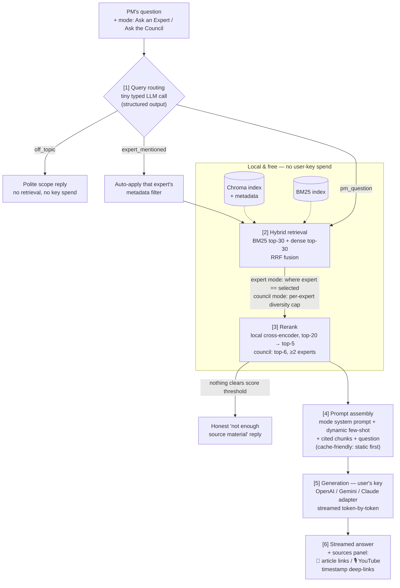

# User Query Flow Plan — AI PDM Leadership Council

Detailed plan for the runtime side (phases 3–4 of `PLAN.md`): what happens between a PM typing
a question and a streamed, cited answer. Companion to `PLAN_DATA_PIPELINE.md` and
`PLAN_TRANSCRIPTS.md`, which produce the indexes this flow consumes. The corpus mixes two
content types — blog articles and Lenny's Podcast transcripts — and every expert in the product
spec is selectable.

## Runtime inputs

- **User-supplied**: provider choice (OpenAI / Gemini / Claude) + pasted API key (session state
  only, never persisted or logged), mode (Ask an Expert with expert dropdown, or Ask the
  Council), and the question.
- **Preloaded at Space boot**: Chroma index, BM25 index, local embedding model, local
  cross-encoder reranker. All free to run; the user's key is spent **only** on answer generation.

## The flow



### [1] Query routing

A single cheap, fast LLM call (user's key, ~200 tokens — negligible cost) classifying the query:

- `pm_question` → proceed to retrieval
- `off_topic` (not about product management) → short scoped reply explaining what the app is
  for; **no retrieval, no generation spend**
- `expert_mentioned` (council mode, but the question names an expert — "what would Shreyas
  say?") → apply that expert's metadata filter automatically

This is the **query routing** optional functionality. Implementation detail: use the provider's
structured-output/function-calling mode so the route is a typed enum, not parsed prose — which
also ticks the **function calling** optional functionality.

### [2] Hybrid retrieval

- Embed the query with the same local `bge-small-en-v1.5` used at index time.
- Dense top-30 from Chroma + sparse top-30 from BM25, fused with **Reciprocal Rank Fusion**
  (simple, no score-calibration headaches).
- **Ask an Expert**: Chroma `where={"expert": selected}` and BM25 candidates filtered the same
  way — the mode is literally a metadata filter (metadata filtering optional functionality).
  `content_type` (blog vs `podcast_transcript`) is a second filter dimension, exposed as an
  optional "source type" toggle in the UI.
- **Ask the Council**: no expert filter; after fusion, enforce diversity — cap chunks per expert
  so the context holds 2–4 distinct voices rather than one expert's five best chunks. This cap
  also prevents a single 80 KB podcast transcript from dominating retrieval.

### [3] Reranking

Local `bge-reranker-base` cross-encoder scores (query, chunk) pairs for the fused top-20.
Keep top-5 (expert mode) or top-6 with a ≥2-experts constraint (council mode). Score threshold:
if nothing clears it, say so honestly ("the council hasn't written much on this") instead of
padding the context with weak chunks.

### [4] Prompt assembly

- **System prompt** per mode:
  - Expert mode: "Answer in the spirit of {expert}'s published thinking. Ground every claim in
    the provided excerpts; where the excerpts are silent, say so." Never first-person
    impersonation — the app channels published thinking, it doesn't pretend to be the person.
  - Both modes: **synthesize, don't quote verbatim** — podcast-transcript chunks are spoken
    word ("you know, I think..."), and without this instruction the filler leaks into answers.
  - Council mode: produce the structured format from the product spec — **Your Situation** (one
    line reframing) → **Perspective per expert** (grouped by the experts actually retrieved) →
    **Recommended Actions** (numbered, concrete).
- **Dynamic few-shot** (optional functionality): a small library of ~10 hand-written exemplar
  Q&A pairs, each pre-embedded; at query time include the 1–2 most similar to the user's
  question. Keeps the format sharp without burning tokens on irrelevant examples.
- **Chunks** injected with citation markers: `[1] Marty Cagan — "Product vs. Feature Teams"`.
- **Prompt-caching-friendly layout** (optional functionality, stretch): static system prompt
  and instructions first, variable content (few-shot, chunks, question) last, so providers'
  prefix caching applies across turns in a session.

### [5] Generation — provider abstraction

One thin interface, three adapters:

```python
class LLMClient(Protocol):
    def stream(self, system: str, messages: list[Message]) -> Iterator[str]: ...
    def classify(self, prompt: str, schema: type[BaseModel]) -> BaseModel: ...  # routing
```

- Adapters: `openai` (gpt-4o-mini), `google-genai` (gemini-2.0-flash), `anthropic`
  (claude-haiku) — cheap default models, hardcoded per provider to keep the cost story simple.
- Key validated with a ~1-token ping on first use; clear error message on a bad key.
- **Streaming** (optional functionality): all three adapters yield text deltas; Gradio's
  chat streams them token-by-token.

### [6] Answer + sources

Streamed markdown answer followed by a sources block for each chunk actually cited —
attribution is a product feature here, not a footnote. Format depends on content type:

- Blog: `📄 Marty Cagan — "Product vs. Feature Teams" → article link`
- Podcast: `🎙 Shreyas Doshi on Lenny's Podcast (14:32) → YouTube deep-link (&t=872)` — the
  chunk's timestamp makes "watch them say it" a one-click citation.

## Gradio app structure

```
app.py                # Gradio Blocks UI + wiring only
rag/
  router.py           # [1] routing (structured output)
  retrieve.py         # [2] hybrid search + fusion + filters
  rerank.py           # [3] cross-encoder
  prompts.py          # [4] system prompts, few-shot library + selector
  llm.py              # [5] provider protocol + 3 adapters
  pipeline.py         # orchestrates 1–6, yields streamed events
```

UI layout (per research.md R13, modeled on the Towards AI tutor Space, adapted): left sidebar
with the expert roster (avatars + names; mode toggle drives it — all-selected in council mode,
single-select in expert mode) and the API-key setup (type="password", prominent — BYO key is
mandatory here, unlike the reference); empty-state hero with ~4 example PM-situation cards
that submit on click; provider chip near the input bar; first-class sources panel (📄/🎙)
under each answer. Themed Gradio Blocks + custom CSS — clean, not pixel-perfect. Indexes and
local models load once at Space startup, shared across sessions.

## Cost per query (user's key, cheap-tier models)

| Step | Tokens | Notes |
|---|---|---|
| Routing | ~250 | tiny classification call |
| Generation in | ~3,500 | system + few-shot + 5–6 chunks + question |
| Generation out | ~700 | structured answer |

≈ $0.001–0.003 per query on gpt-4o-mini / gemini-flash / haiku → **~15 test queries ≈ $0.02–0.05**,
comfortably under the $0.50 requirement. Embedding, retrieval, and reranking cost the user $0.

## Optional functionalities exercised at runtime

1. Streaming responses
2. Hybrid search
3. Metadata filtering (expert mode + auto-filter from routing)
4. Query routing
5. Reranker
6. Function calling (typed routing via structured output)
7. Dynamic few-shot prompting
8. Prompt-caching-friendly prompt layout (stretch)

## Build order

1. `llm.py` + `retrieve.py` with plain dense search → walking-skeleton `app.py` that answers
   with citations (proves the end-to-end path on the real index)
2. Add hybrid + rerank; spot-check retrieval quality against the pipeline's chunks
3. Add routing, council-mode diversity + synthesis prompt, dynamic few-shot
4. Polish: streaming edge cases, bad-key handling, empty-retrieval handling
5. Then the evaluation phase (`PLAN.md` phase 5) measures this exact pipeline
